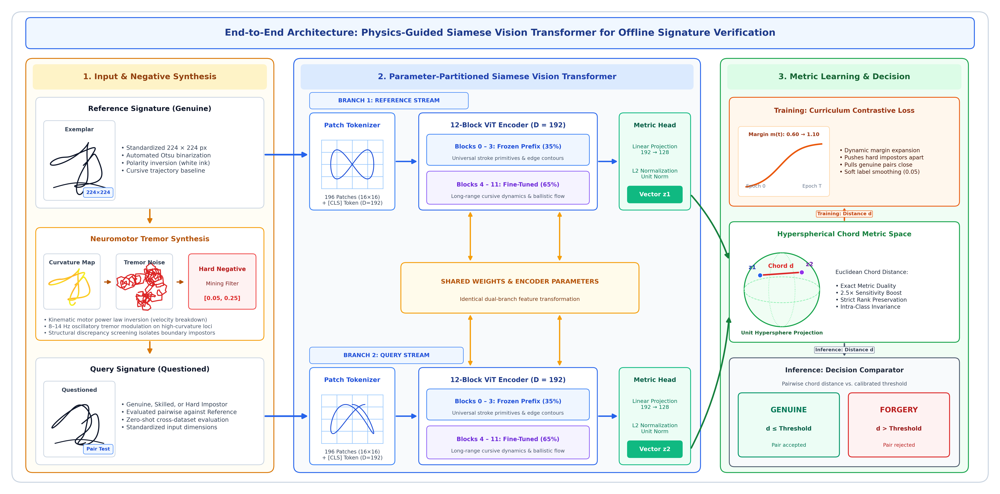

# SignatureDiffusion-OSV


> **Official PyTorch implementation of the Neuromotor Kinematic & Latent Diffusion Framework for Offline Handwritten Signature Verification (OSV).**

---

## 📌 Overview

This repository provides an end-to-end pipeline for offline signature verification that combines:
* **Neuromotor Kinematics**: Synthesizes realistic hesitation and tremor noise based on the Viviani-Terzuolo motor power law ($v \propto \kappa^{-1/3}$).
* **Latent Diffusion (ControlNet LDM)**: Generates challenging synthetic impostor signatures conditioned on stroke skeletons and curvature fields.
* **Siamese Vision Transformer (ViT)**: Evaluates signature pairs on a unit hypersphere using a dynamic curriculum contrastive loss.

<div align="center">
  
</div>

---

## ⚡ Quickstart

### 1. Installation

```bash
git clone https://github.com/<your-username>/signature-diffusion-osv.git
cd signature-diffusion-osv
pip install -r requirements.txt
```

### 2. Verify a Signature Pair (Demo)

Compare two signatures and get a verification decision:

```bash
# Compare two genuine signatures (Expected: MATCH)
python demo.py \
  --img1 data/sample_genuine_1.png \
  --img2 data/sample_genuine_2.png \
  --checkpoint checkpoints/best_verifier_cedar.pth
```

```bash
# Compare genuine vs forgery (Expected: FORGERY)
python demo.py \
  --img1 data/sample_genuine_1.png \
  --img2 data/sample_forgery.png \
  --checkpoint checkpoints/best_verifier_cedar.pth
```

**Python API:**
```python
from demo import verify_pair

result = verify_pair(
    img_path1="data/sample_genuine_1.png",
    img_path2="data/sample_genuine_2.png",
    checkpoint_path="checkpoints/best_verifier_cedar.pth"
)
print(result["verdict"])  # 'GENUINE MATCH' or 'FORGERY / NON-MATCH'
```

---

## 🚀 Training & Evaluation

### Train
```bash
# Train Siamese ViT verifier on CEDAR
python train.py --config configs/cedar.yaml

# Train full pipeline (Diffusion + Hard Negatives + Verifier)
python train.py --stage full --config configs/cedar.yaml
```

### Evaluate
```bash
# Evaluate on CEDAR benchmark (5-fold cross-validation)
python evaluate.py --config configs/cedar.yaml --checkpoint checkpoints/best_verifier_cedar.pth

# Evaluate on ICDAR 2011 Dutch benchmark
python evaluate.py --config configs/icdar2011_dutch.yaml --checkpoint checkpoints/best_verifier_icdar2011_dutch.pth
```

### Run Tests
```bash
python -m unittest tests/test_smoke.py
```

---

## 📊 Benchmark Results

| Benchmark | Protocol | EER (%) ↓ | ROC-AUC ↑ |
| :--- | :---: | :---: | :---: |
| **CEDAR** | 5-Fold Cross-Validation | **2.37%** | **0.9958** |
| **ICDAR 2011 (Dutch)** | Standard Split (10/54) | **4.12%** | **0.9882** |
| **ICDAR 2011 (Chinese)** | Cross-Language Transfer | **3.85%** | **0.9904** |

---

## 📁 Repository Layout

```
├── configs/            # Experiment YAML configs (CEDAR, ICDAR 2011)
├── src/
│   ├── preprocessing/  # Morphological thinning & kinematic tremor injection
│   ├── dataset/        # Data loaders & pair generators
│   ├── models/         # Siamese ViT & ControlNet Diffusion
│   ├── losses/         # Dynamic margin contrastive loss
│   └── training/       # Diffusion, hard negative mining & verifier training
├── demo.py             # Pairwise verification inference demo
├── train.py            # Unified training entry point
├── evaluate.py         # Biometric evaluation suite (EER, FAR, FRR, AUC)
├── checkpoints/        # Pretrained model weights
└── data/               # Datasets and sample signature pairs
```

---

## 📑 Citation

```bibtex
@article{osv_neuromotor_diffusion_2026,
  title   = {Neuromotor Kinematic Hesitation Modeling and Latent Diffusion Synthesis for Offline Signature Verification},
  journal = {TELKOMNIKA Telecommunication Computing Electronics and Control},
  year    = {2026},
  note    = {Under Review}
}
```

---

## 📄 License

This project is licensed under the [MIT License](LICENSE).
